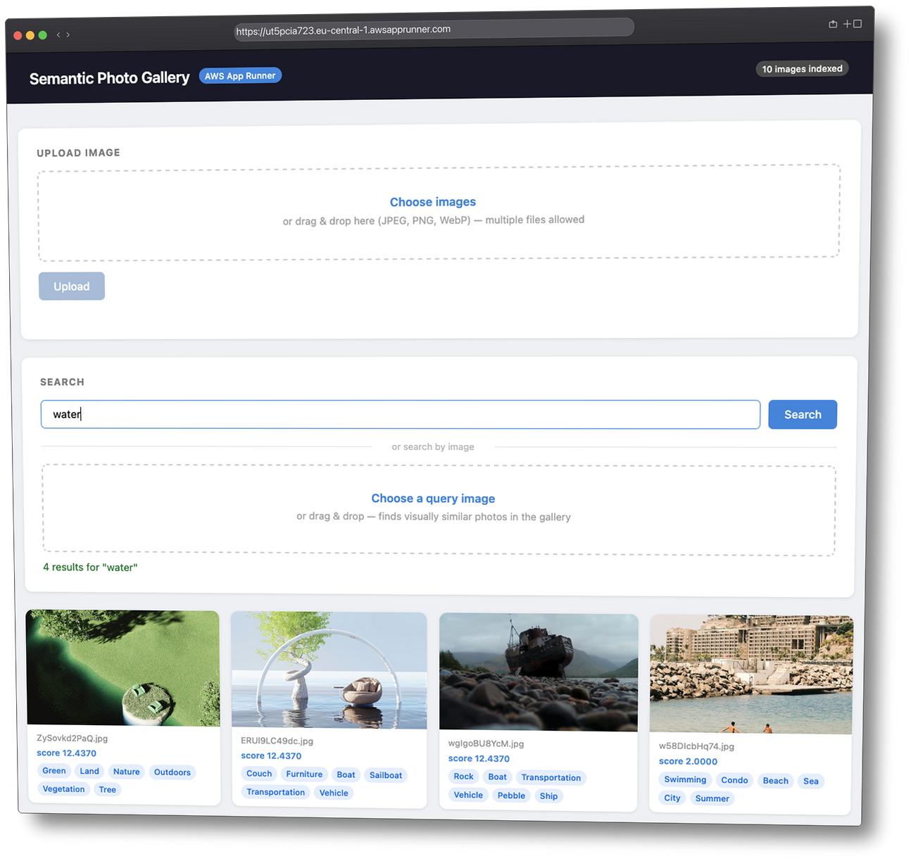

# kata-aws-imgproc-pipeline

[](https://github.com/deeplook/kata-aws-imgproc-pipeline/actions/workflows/ci.yml)
[](https://github.com/deeplook/kata-aws-imgproc-pipeline/releases)
[](LICENSE)
[](https://www.python.org)
[](https://www.terraform.io)
[](https://aws.amazon.com)
[](https://www.buymeacoffee.com/deeplook)

A progressive AWS kata for building a serverless semantic photo pipeline, from a stubbed S3-triggered Lambda to a searchable image gallery.

## Branches

- `main`: learner branch with staged stubs, placeholders, and kata instructions
- `solution`: completed reference implementation, including the App Runner gallery frontend

If you want to do the exercise, stay on `main`.
If you want the finished reference, inspect `solution`.



Completed `solution` branch frontend preview.

## What You Are Building

Core pipeline:

1. A user uploads a photo to **S3**
2. S3 triggers the **ingest Lambda**
3. Lambda calls **Rekognition** for visual labels
4. Lambda calls **Bedrock** (Titan Embed) to generate a 1024-dimension vector
5. Metadata is written to **DynamoDB** and indexed in **OpenSearch Serverless**
6. A **search Lambda** behind **API Gateway** accepts natural-language queries and returns semantically ranked results

Reference solution extras on `solution`:

1. An **App Runner** gallery frontend
2. Browser upload flow
3. Text search and image-based search
4. Indexed image count and presigned image URLs

## Cost Warning

This kata currently uses **OpenSearch Serverless** for vector search.
That is convenient for the exercise, but expensive for casual experimentation.

`COSTS.md` currently estimates the default stack at roughly **$700/month idle**, mostly from AOSS capacity.
Do not run `make deploy` until you have read `COSTS.md` and decided that cost is acceptable for your use case.

## Prerequisites

| Tool | Version | Purpose |
|------|---------|---------|
| Terraform | >= 1.3 | Infrastructure provisioning |
| Python | 3.12 | Lambda runtime and local tooling |
| [uv](https://github.com/astral-sh/uv) | latest | Python dependency management |
| AWS CLI | v2 | Credentials, log tailing |

AWS credentials must be configured with permissions for Lambda, S3, IAM, Rekognition, Bedrock, DynamoDB, OpenSearch Serverless, API Gateway, and App Runner if you plan to use the `solution` frontend.

## Using This Repo

For the kata path on `main`:

```bash
make install
make setup
```

Then work through `KATA.md` stage by stage.

For the completed flow on `solution`:

```bash
make install
make deploy
make upload
make search QUERY=beach
make smoke-frontend
make destroy
```

## Stage Layout

`main` teaches the pipeline in 7 core stages:

| # | Title | New Service |
|---|-------|-------------|
| 1 | S3 -> Lambda hello | S3, Lambda |
| 2 | Rekognition labels | Rekognition |
| 3 | DynamoDB metadata | DynamoDB |
| 4 | Bedrock embeddings | Bedrock |
| 5 | OpenSearch indexing | OpenSearch Serverless |
| 6 | Search Lambda + APIGW | API Gateway |
| 7 | IaC polish + e2e | Consolidation |

The `solution` branch additionally includes a frontend stage built on App Runner.

## Repository Guide

- `KATA.md`: full stage-by-stage exercise
- `COSTS.md`: cost analysis and cheaper alternatives
- `docs/architecture.md`: visual overview of the completed solution branch
- `docs/terraform-modules.md`: generated module graph from `terraform/main.tf`
- `terraform/`: infrastructure modules
- `lambdas/`: ingest and search handlers
- `app/`: gallery frontend used by the `solution` branch
