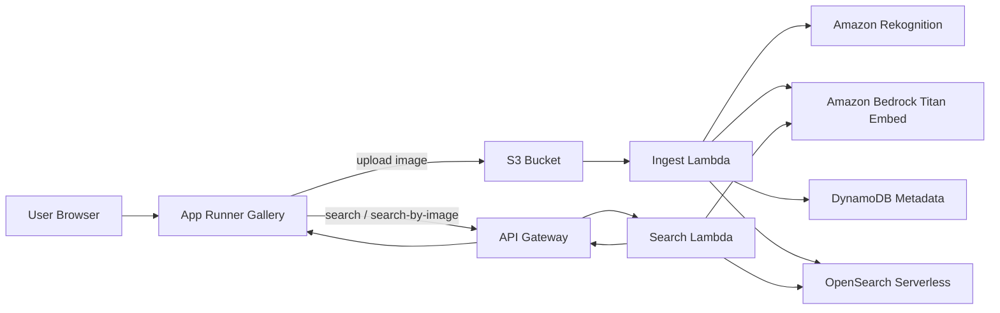

# Solution Architecture

This page describes the completed `solution` branch.

## Runtime Flow

## Terraform Structure

The solution is split into four Terraform modules:

- `storage`: S3 bucket and DynamoDB table
- `ingestion`: ingest Lambda, IAM, and OpenSearch collection setup
- `search`: search Lambda and API Gateway
- `frontend`: ECR image build/push and App Runner service

For a generated view of how those modules are wired together, see [terraform-modules.md](terraform-modules.md).
