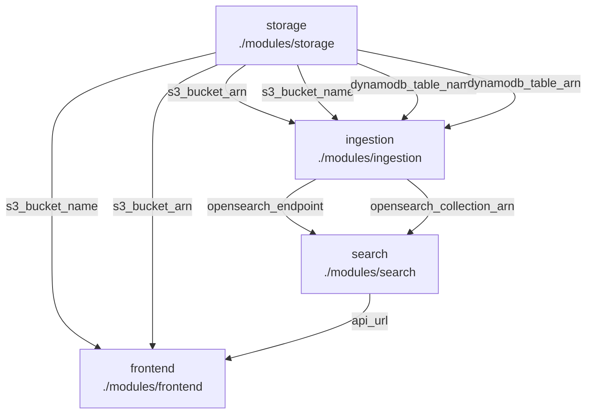

# Terraform Module Graph

Generated from `terraform/main.tf`.

## Module Wiring

| Module | Source | Inputs |
|---|---|---|
| `storage` | `./modules/storage` | `bucket_name` = `local.bucket_name` `table_name` = `var.table_name` |
| `ingestion` | `./modules/ingestion` | `s3_bucket_arn` = `module.storage.s3_bucket_arn` `s3_bucket_name` = `module.storage.s3_bucket_name` `table_name` = `module.storage.dynamodb_table_name` `table_arn` = `module.storage.dynamodb_table_arn` `collection_name` = `var.collection_name` `aws_region` = `var.aws_region` |
| `search` | `./modules/search` | `opensearch_endpoint` = `module.ingestion.opensearch_endpoint` `collection_arn` = `module.ingestion.opensearch_collection_arn` `collection_name` = `var.collection_name` `aws_region` = `var.aws_region` |
| `frontend` | `./modules/frontend` | `aws_region` = `var.aws_region` `collection_name` = `var.collection_name` `s3_bucket_name` = `module.storage.s3_bucket_name` `s3_bucket_arn` = `module.storage.s3_bucket_arn` `search_api_url` = `module.search.api_url` |
